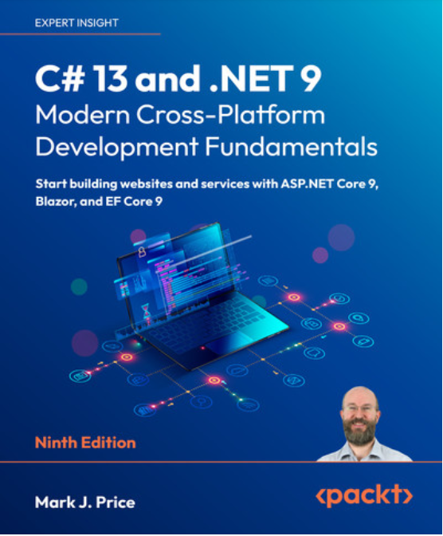

# cs13net9

C# 13 and .NET 9 – Modern Cross-Platform Development Fundamentals - Ninth Edition

An accessible guide for beginner-to-intermediate programmers to the concepts, real-world applications, and latest features of C# 13 and .NET 9, with hands-on exercises using Visual Studio and Visual Studio Code

## Key Features

    -Explore the newest additions to C# 13, the .NET 9 class libraries, and Entity Framework Core 9

    -Build professional websites and services with ASP.NET Core 9 and Blazor

    -Enhance your skills with step-by-step code examples and best practices tips

